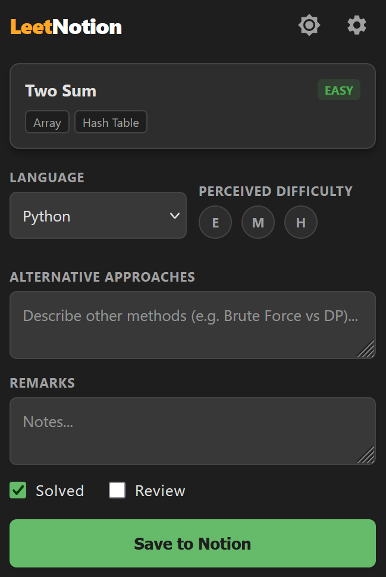
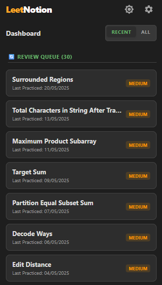
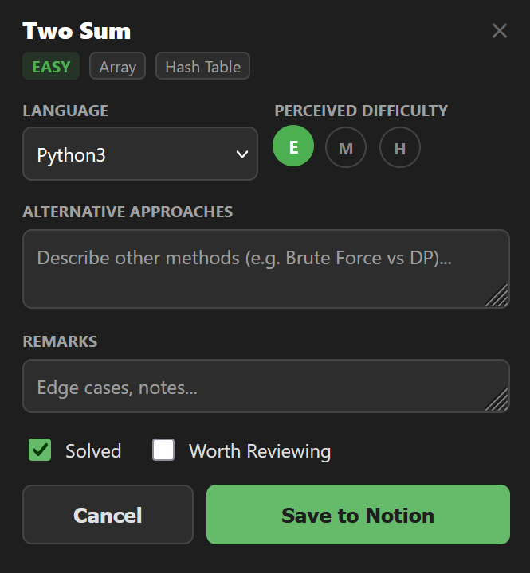
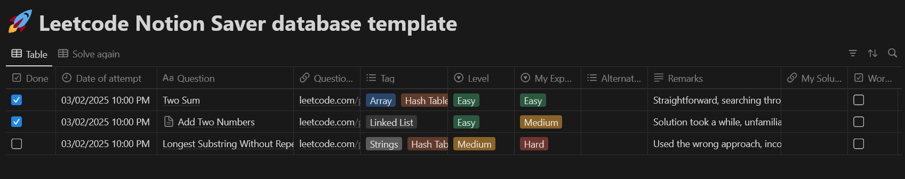

# LeetNotion Sync 🚀

**Master your LeetCode journey by seamlessly syncing problems to Notion.**

**LeetNotion Sync** is a browser extension designed to bridge the gap between your coding practice on LeetCode and your personal knowledge base in Notion. It automates the logging process, creating a smart, organized dashboard of your progress without you ever leaving the problem page.

Whether you're tracking daily streaks, managing a review queue for spaced repetition, or keeping a log of alternative solutions, LeetNotion Sync handles the busy work so you can focus on coding.

---

## ✨ Key Features

* **One-Click Sync:** Instantly save problem metadata (Title, Difficulty, Tags, URL) to your Notion database.
* **Auto-Save Code:** Automatically scrapes your code solution from the editor and saves it as a code block within the Notion page.
* **Smart Dashboard:** Access a prioritized list of **Unsolved Problems** and **Review Candidates** directly from the extension popup when you aren't on LeetCode.
* **Automatic Prompt:** Detects successful submissions and offers a non-intrusive popup to save your victory immediately.
* **Built-in Setup Wizard:** A hassle-free, step-by-step guide to connecting your Notion workspace in seconds.
* **Modern UI:** Clean, dark-mode-first design that fits right into your developer workflow.

---

## 📸 Snapshots

| **Smart Dashboard** | **In-Page Auto Prompt** |
|:---:|:---:|
| Review your queue and track unsolved problems directly from the browser toolbar. | Automatically appears when you submit a solution, pre-filling data for instant saving. |
|  |  |

---

## 🚀 Installation & Setup

## Download from the chrome/firefox store
**We're now on the official chrome/firefox store!**
* Chrome Store link: https://chromewebstore.google.com/detail/leetnotion-sync/dkajphhnkmfogoedigdobmcgfbncffpl
* Firefox Store link: https://addons.mozilla.org/en-US/firefox/addon/leetnotion-sync/

## Manual Install
### Step 1: Install the Extension
1.  **Download the Source Code:**
    * **Chrome:** Download the `download for chrome` folder.
    * **Firefox:** Download the `download for firefox` folder.
2.  **Load into Browser:**
    * **Chrome:** Go to `chrome://extensions/`, toggle **Developer mode** (top right), click **Load unpacked**, and select the project folder.
    * **Firefox:** Go to `about:debugging#/runtime/this-firefox`, click **Load Temporary Add-on**, and select the `manifest.json` file.

### Step 2: Configuration
Once installed, click the **LeetNotion** icon in your toolbar. The **Setup Wizard** will launch automatically to guide you through the process:

1.  **Get the Template:** The wizard provides a link to duplicate our [Notion Template](https://www.notion.so/Leetcode-Notion-Tracker-template-18fcc053f74480429974f527540d02b6).
2.  **Connect Notion:** Create a free Internal Integration at [Notion Integrations](https://www.notion.so/my-integrations) and paste the API Key.
3.  **Link Database:** Copy the Database ID from your template's URL.

The wizard will test your connection to ensure everything is perfect!

---

## 🧠 How It Works

### Scene A: Solving & Saving
When you are on a LeetCode problem page, the extension acts as a **Save Tool**.
1.  **Solve & Submit:** Write your code and run it.
2.  **Auto-Detect:** Upon a successful submission, a modal appears.
3.  **Enrich:** Add your "Perceived Difficulty" (was it actually Hard for you?), alternative approaches (e.g., "DFS vs BFS"), and notes.
4.  **Save:** Click save, and your code + metadata are instantly pushed to Notion.

### Scene B: Reviewing & Tracking
When you click the extension icon **away from LeetCode**, it transforms into a **Dashboard**.
* **Unsolved List:** See problems you started but marked as "Not Solved".
* **Review Queue:** See problems you solved but flagged as "Worth Reviewing".
* **Smart Sorting:** Uses a "Latest Entry Wins" logic. Your most recent attempt determines the problem's status, keeping your history accurate but your to-do list clean.

---

## 📊 The Notion Template
The extension is built to work perfectly with this database structure. It categorizes problems by difficulty, tags, and review status.

---

## 🛠️ Contributing

We welcome contributions! If you have ideas for new features or spot a bug, please:
1.  Fork the repository.
2.  Create a feature branch (`git checkout -b feature/AmazingFeature`).
3.  Commit your changes.
4.  Open a Pull Request.

---

*Happy Coding!* 🚀